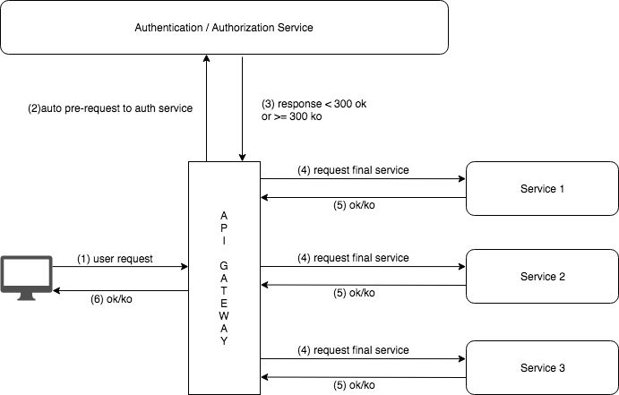

# Kong-Middleman
Kong docker image with [middleman plugin](https://github.com/pantsel/kong-middleman-plugin) already installed

Kong requests a service or URL before reaching the final one. If an HTTP response code < 300 is returned, the request is accepted. If it is >= 300 request would be rejected



Requirements
  - Docker

### Docker build
```sh
$ git clone https://github.com/mdemou/kong-middleman
$ cd kong-middleman
$ docker build kong-middleman:${imagenumber} .
```

### Docker run
```sh 
$ docker run --rm \
-e "KONG_DATABASE=postgres" \
-e "KONG_CASSANDRA_CONTACT_POINTS={{ RDS-Endpoint }}" \
-e "KONG_PG_DATABASE={{ DB Name }}" \  
-e "KONG_PG_HOST={{ RDS-Endpoint }}" \  
-e "KONG_PG_USER={{ DB Name }}" \    
-e "KONG_PG_PASSWORD={{ DB Password }}" \    
kong-middleman:${imagenumber}
```

## Support and PR
Feel free to ask for support, or pull requests with improvements this repository. I will be very happy to hear from you, and make this as useful as possible

## Thanks!
> It is great to share this with all of you, and could be useful :)

## License
Check LICENSE file

---
> GitHub [@mdemou](https://github.com/mdemou/)


